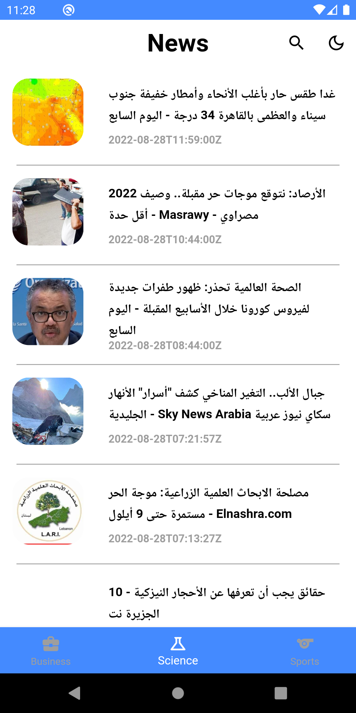

# News_app

A news app with 3 main sections ( Business / Science / Sports )

## Flutter Version
Flutter 3.0.4 

## Snapsots
     

## Preview

## Application Features
* Bloc State Managment.
* Receiving Data from Api using Dio Package.
* Shared preferences.
* Dark Theme.

  
## plugins used
- [cupertino_icons](https://pub.dev/packages/cupertino_icons): ^1.0.2
- [sqflite](https://pub.dev/packages/sqflite): ^2.0.3
- [intl](https://pub.dev/packages/intl) : ^0.17.0 # for date_format
- [conditional_builder_null_safety](https://pub.dev/packages/conditional_builder_null_safety): ^0.0.6
- [bloc](https://pub.dev/packages/bloc): ^^8.1.0
- [flutter_bloc](https://pub.dev/packages/flutter_bloc): ^8.0.1
- [dio](https://pub.dev/packages/dio): ^4.0.6
- [shared_preferences](https://pub.dev/packages/shared_preferences): ^2.0.15
- [webview_flutter](https://pub.dev/packages/webview_flutter): ^3.0.4
- [animated_text_kit](https://pub.dev/packages/animated_text_kit): ^4.2.2
---
## Note about the source code

This app was created while learning Flutter , Suggestions and Improvements are most Welcomed! :)
